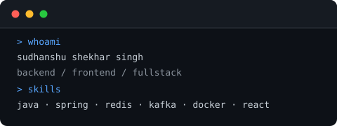

```
 ____            _  _                     _            
/ ___| _   _  __| || |__   __ _ _ __  ___| |__  _   _ 
\___ \| | | |/ _` || '_ \ / _` | '_ \/ __| '_ \| | | |
 ___) | |_| | (_| || | | | (_| | | | \__ \ | | | |_| |
|____/ \__,_|\__,_||_| |_|\__,_|_| |_|___/_| |_|\__,_|
```

# Hi, I'm Sudhanshu 👋



Backend developer focused on building scalable systems with Java and Spring Boot.

---

## 🚀 About Me

* Backend developer with a focus on Java and Spring Boot — occasionally Go
* Built systems from scratch: real-time chat over raw WebSockets, a CLI search engine with a custom inverted index, and URL shorteners with Redis caching and analytics
* Interested in system design, distributed systems, and search infrastructure
* On the frontend, I work with React and TypeScript to build clean, functional UIs
* Have shipped full-stack projects end-to-end, from REST APIs to responsive frontends

---

## 🛠️ Tech Stack

### Languages


### Backend


### Frontend


### Database & Cache


### DevOps & Tools


---

## 📌 Projects

Check out my work → [portfolio1-eight-snowy-85.vercel.app](https://portfolio1-eight-snowy-85.vercel.app/)

---

## 📈 GitHub Stats


---

## 🌐 Connect With Me

- [](https://portfolio1-eight-snowy-85.vercel.app/)
- [](https://www.linkedin.com/in/sudhanshu-singh-1672b3225/)
- [](mailto:sudhanshu.singh.work@gmail.com)

---

## ⚡ Fun Fact

It works on my machine. Shipping my machine is still on the roadmap.

```
 ________________________________
< an overthinker writes good tests >
 --------------------------------
        \   ^__^
         \  (oo)\_______
            (__)\       )\/\
                ||----w |
                ||     ||
```
